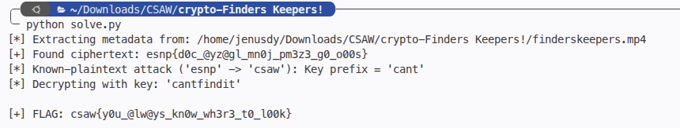

# Finders Keepers!
> Video steganography & Vigenère cipher with known plaintext attack

## About the Challenge
In this challenge, we are provided with an MP4 video file: `finderskeepers.mp4`. The title "Finders Keepers!" hints that something valuable is hidden inside the media file waiting to be discovered.

## How to Solve?

### 1. Metadata Extraction
Examining the file's raw metadata or XMP packet reveals an embedded `<dc:subject>` entry within the video:

```xml
<dc:subject>
  <rdf:Bag>
    <rdf:li>ZXNucHtkMGNfQHl6QGdsX21uMGpfcG0zejNfZzBfbzAwc30=</rdf:li>
  </rdf:Bag>
</dc:subject>
```

Decoding the base64 payload gives the ciphertext:
```python
import base64
ciphertext = base64.b64decode("ZXNucHtkMGNfQHl6QGdsX21uMGpfcG0zejNfZzBfbzAwc30=").decode()
print(ciphertext)
# esnp{d0c_@yz@gl_mn0j_pm3z3_g0_o00s}
```

### 2. Known-Plaintext Attack (KPA)
The ciphertext `esnp{d0c_@yz@gl_mn0j_pm3z3_g0_o00s}` has standard flag punctuation. Since CSAW CTF flags always begin with `csaw{...}`:
- `e` $\rightarrow$ `c`: shift = $(4 - 2) \pmod{26} = 2$ (`c`)
- `s` $\rightarrow$ `s`: shift = $(18 - 18) \pmod{26} = 0$ (`a`)
- `n` $\rightarrow$ `a`: shift = $(13 - 0) \pmod{26} = 13$ (`n`)
- `p` $\rightarrow$ `w`: shift = $(15 - 22) \pmod{26} = 19$ (`t`)

This reveals the key prefix `cant`. Fitting the challenge title "Finders Keepers" ("can't find it"), the full Vigenère key is `cantfindit`.

### 3. Decryption
Decrypting the ciphertext with the key `cantfindit` (preserving numbers and symbols):

```python
def vigenere_decrypt(ciphertext: str, key: str) -> str:
    plaintext = []
    key_idx = 0
    key = key.lower()
    for ch in ciphertext:
        if ch.isalpha():
            base = ord('a') if ch.islower() else ord('A')
            c_val = ord(ch) - base
            k_val = ord(key[key_idx % len(key)]) - ord('a')
            p_val = (c_val - k_val) % 26
            plaintext.append(chr(p_val + base))
            key_idx += 1
        else:
            plaintext.append(ch)
    return ''.join(plaintext)
```

Running `solve.py` outputs the flag:



```text
flag : csaw{y0u_@lw@ys_kn0w_wh3r3_t0_l00k}
```
