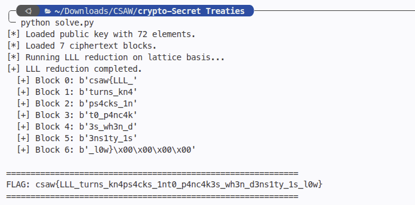

# Secret Treaties
> Low-density subset sum / Merkle-Hellman knapsack cryptosystem broken via lattice reduction (LLL + CVP)

## About the Challenge
We are given a public key file `pubkey.txt` containing 72 integers (~96 bits each) and `ciphertext.txt` containing 7 encrypted blocks.

Each block encrypts 9 bytes (72 bits) using a subset sum / knapsack scheme:
$$C = \sum_{i=0}^{71} m_i \cdot A_i, \quad m_i \in \{0, 1\}$$

## How to Solve?

### 1. Density Analysis
The density of a knapsack instance is given by:
$$d = \frac{n}{\log_2(\max(A))} \approx \frac{72}{96} \approx 0.75$$

According to the CJLOSS (Coster, Joux, LaMacchia, Odlyzko, Schnorr, Stern) result, whenever the density $d < 0.9408$, the subset sum problem can be reduced to the Shortest Vector Problem (SVP) or Closest Vector Problem (CVP) on a lattice and solved in polynomial time.

### 2. Centered Target Lattice Construction
To make all binary solutions equidistant from a target, we shift variables $x_i \in \{0, 1\}$ to $2x_i - 1 \in \{-1, 1\}$.

We build an $n \times (n+1)$ lattice basis matrix $B$:
- Row $i$: $[2 \cdot A_i, 0, \dots, 2, \dots, 0]$ (with $2$ at column $i+1$)
- Target vector $T$: $[2C, 1, 1, \dots, 1]$

For any valid binary solution vector $x$, the corresponding lattice vector has:
$$v = \left[ 2\sum_{i=0}^{n-1} x_i A_i, 2x_0, 2x_1, \dots, 2x_{n-1} \right]$$

The difference vector $v - T$ is:
$$[0, 2x_0 - 1, 2x_1 - 1, \dots, 2x_{n-1} - 1]$$
Since $2x_i - 1 = \pm 1$, the Euclidean squared norm is exactly:
$$\|v - T\|^2 = 0^2 + \sum_{i=0}^{n-1} (\pm 1)^2 = n = 72$$
This is an exceptionally short vector in the lattice, making CVP enumeration fast and reliable.

### 3. Solving with `fpylll`
Using `fpylll`, we reduce the lattice basis with LLL and solve CVP for each ciphertext block:

```python
from fpylll import IntegerMatrix, LLL, CVP

B = IntegerMatrix(n, n + 1)
for i in range(n):
    B[i, 0] = 2 * pubkey[i]
    B[i, i + 1] = 2

LLL.reduction(B)

for idx, ct in enumerate(ciphertexts):
    target = tuple([2 * ct] + [1] * n)
    v = CVP.closest_vector(B, target, method="fast")
    bits = [v[i + 1] // 2 for i in range(n)]
    # Convert 72 bits to 9 bytes...
```

Each 72-bit block decodes cleanly into 9 ASCII characters:
- Block 0: `csaw{LLL_`
- Block 1: `turns_kn4`
- Block 2: `ps4cks_1n`
- Block 3: `t0_p4nc4k`
- Block 4: `3s_wh3n_d`
- Block 5: `3ns1ty_1s`
- Block 6: `_l0w}`

Running `solve.py` gives:



```text
flag : csaw{LLL_turns_kn4ps4cks_1nt0_p4nc4k3s_wh3n_d3ns1ty_1s_l0w}
```
