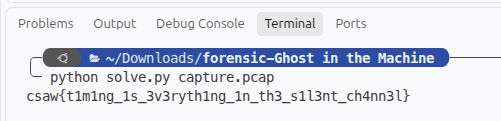

# Ghost in the Machine
> Network PCAP forensics, covert timing channels & port modulation

## About the Challenge
We are given a network capture file `capture.pcap`. Our task is to analyze the capture and uncover covert communication hidden within the network traffic.

## How to Solve?

### 1. Fixing PCAP Magic Bytes
Opening `capture.pcap` initially shows corrupted header bytes:
- File starts with `0xc4c3b2a1` instead of standard little-endian PCAP magic `0xd4c3b2a1`.
- Changing `0xc4` to `0xd4` restores the valid file header (`capture_fixed.pcap`), allowing standard parsing tools to process the packets.

### 2. Filtering the "Machine" Stream
Inspecting the IP headers of the packets reveals that packets originating from the covert stream use IP **TTL = 64**. Filtering by `ip.ttl == 64` isolates the relevant traffic.

### 3. Key Extraction via UDP Source Ports
Looking at the UDP source ports in this stream reveals values around 40100:
- $p - 40000 = \text{ord}(c)$
- Taking the character transitions across the source ports yields:
  `'s'`, `'h'`, `'4'`, `'d'`, `'o'`, `'w'`
- This reveals the 6-byte repeating XOR key: `sh4dow`.

### 4. Covert Timing Channel Extraction
Analyzing the inter-packet arrival times ($\Delta t = t_i - t_{i-1}$) shows two distinct clusters of packet delays:
- Short delay ($\approx 0.05$ seconds) $\rightarrow$ bit `0`
- Long delay ($\approx 0.15$ seconds) $\rightarrow$ bit `1`

By setting a threshold halfway between min and max deltas (~0.10s), we convert the timestamps into a sequence of binary bits.

### 5. Decryption
Assembling bits into bytes (8 bits per byte, MSB first) and XOR-decrypting with the key `sh4dow`:

```python
# 1. Recover repeating key from source ports
key = b"sh4dow"

# 2. Extract timing channel bits
deltas = [machine_times[i] - machine_times[i - 1] for i in range(1, len(machine_times))]
threshold = (min(deltas) + max(deltas)) / 2
bits = [0 if d < threshold else 1 for d in deltas]

# 3. Assemble bytes and XOR decrypt
raw_bytes = bytearray()
for i in range(0, len(bits), 8):
    byte_val = 0
    for bit in bits[i : i + 8]:
        byte_val = (byte_val << 1) | bit
    raw_bytes.append(byte_val)

flag = bytes([b ^ key[i % len(key)] for i, b in enumerate(raw_bytes)]).decode()
```

Running `solve.py` gives:



```text
flag : csaw{t1m1ng_1s_3v3ryth1ng_1n_th3_s1l3nt_ch4nn3l}
```
