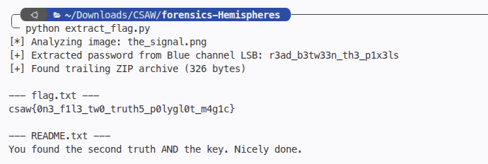

# Hemispheres
> PNG LSB steganography & polyglot encrypted archive extraction

## About the Challenge
We are given an image file named `the_signal.png`. The challenge concept revolves around two halves ("Hemispheres"): "The Pixels" holding the key, and "The Tail" holding the lock.

## How to Solve?

### 1. Extracting the Key (Blue Channel LSB)
Analyzing the pixel data of `the_signal.png` reveals that data is hidden in the Least Significant Bit (LSB) of the Blue color channel:
- Extracting the LSB of the Blue channel across all RGB pixels.
- Packing the bits into bytes (8 bits per byte, MSB first).
- The first 2 bytes store the length of the key as a 16-bit big-endian integer.
- The following bytes yield the ASCII password:
  `r3ad_b3tw33n_th3_p1x3ls`

```python
from PIL import Image

img = Image.open("the_signal.png").convert("RGB")
pixels = img.getdata()
bits = [b & 1 for _, _, b in pixels]

byte_arr = bytearray()
for i in range(0, len(bits), 8):
    chunk = bits[i : i + 8]
    if len(chunk) < 8:
        break
    byte = 0
    for bit in chunk:
        byte = (byte << 1) | bit
    byte_arr.append(byte)

key_length = int.from_bytes(byte_arr[:2], "big")
password = bytes(byte_arr[2 : 2 + key_length]).decode()
print("Password:", password)
# r3ad_b3tw33n_th3_p1x3ls
```

### 2. Extracting the Embedded ZIP Archive
Examining the raw bytes of `the_signal.png` past the PNG `IEND` chunk reveals appended data starting with the standard ZIP magic bytes `PK\x03\x04` (`\x50\x4b\x03\x04`):

```python
with open("the_signal.png", "rb") as f:
    data = f.read()

zip_offset = data.find(b"PK\x03\x04")
zip_bytes = data[zip_offset:]
```

### 3. Decrypting the Archive
The extracted ZIP archive is password-protected. Using the password recovered from the blue channel (`r3ad_b3tw33n_th3_p1x3ls`), we extract the archive contents:
- `README.txt`: "You found the second truth AND the key. Nicely done."
- `flag.txt`: `csaw{0n3_f1l3_tw0_truth5_p0lygl0t_m4g1c}`

Running `extract_flag.py` outputs:



```text
flag : csaw{0n3_f1l3_tw0_truth5_p0lygl0t_m4g1c}
```
