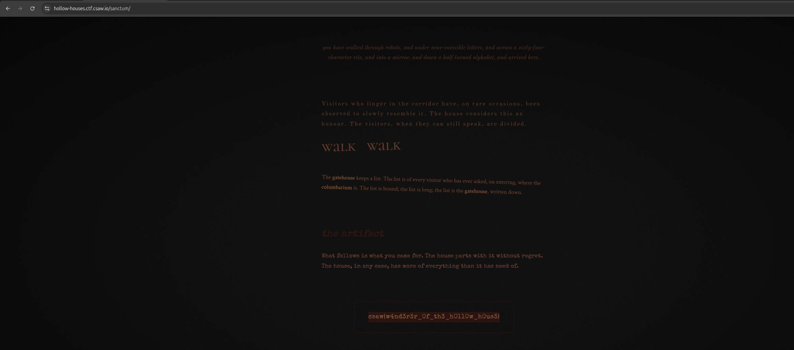

# House of Hollow Houses
> Web labyrinth traversal, hidden text, encoding challenges & path discovery

## About the Challenge
We are given a link to a static web labyrinth: `https://hollow-houses.ctf.csaw.io/`.


> *"A labyrinth of "hollow" rooms served as a static website — each room links to others, and the flag lies waiting in the sanctum. Players wander the interlinked rooms (and read what the pages are quietly telling them) to find the way in."*

## How to Solve?

### 1. Navigating the Maze
The challenge requires traversing a network of interconnected rooms on the static site. Each page contains subtle clues pointing to the next route or door:

- **Robots**: Checking `/robots.txt` reveals disallowed paths and entry corridors into the house.
- **Near-invisible letters**: Inspecting HTML source code and styles exposes low-contrast or hidden text styled with colors blending into the dark background.
- **Sixty-four-character rite**: Decoding Base64-encoded strings found in page comments and attributes.
- **Mirror**: Reversing backward strings to reveal room endpoint paths.
- **Half-turned alphabet**: Applying ROT13 decryption to decipher room titles and hints.

### 2. Entering the Sanctum
Following the complete sequence of clues leads to the inner chamber at:
`https://hollow-houses.ctf.csaw.io/sanctum/`

The room description confirms our path:
> *"you have walked through robots, and under near-invisible letters, and across a sixty-four-character rite, and into a mirror, and down a half-turned alphabet, and arrived here."*

Under **the artifact**, the flag is revealed:



```text
flag : csaw{w4nd3r3r_0f_th3_h0ll0w_h0us3}
```
