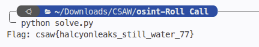

# Roll Call
> OSINT / Case file analysis & database investigation using SQLite

## About the Challenge
We are given an archive `d.zip` containing an investigative case file dossier: `timeline`, `comms`, and an SQLite database `roll-call/case_file/intake.db`.

According to the case protocol:
- `intake.db` is the authoritative record of truth.
- One individual can use multiple online handles (mapped via the `identities` table).
- The `watchlist` tracks subjects by handle, but has fallen behind.
- Exactly two subjects were escalated to the detail (`escalations` table) and were never written down on the watchlist.
- **Flag Format**: `csaw{handle_handle}` (lowercase, alphabetical order, joined by an underscore).

## How to Solve?

### 1. Database Schema Exploration
Examining `intake.db` reveals three relevant tables:
- `identities`: Maps each `handle` to a corresponding `person_id` and indicates whether it is the primary handle (`is_primary`).
- `watchlist`: Contains handles currently being monitored.
- `escalations`: Records handles that have been escalated.

### 2. Identifying Missing Escalated Subjects
Because one person can use multiple handles, we must resolve handles to `person_id` rather than comparing handle strings directly:

1. Map all handles to `person_id` using `identities`.
2. Find all `person_id`s present in `watchlist`.
3. Find all `person_id`s present in `escalations`.
4. Identify which escalated individuals are absent from the watchlist:
   $$\text{Missing} = \text{Escalated Persons} \setminus \text{Watchlist Persons}$$

### 3. Automated Extraction Script
We write a short script to query `intake.db`:

```python
import sqlite3

conn = sqlite3.connect("roll-call/case_file/intake.db")
cur = conn.cursor()

# Map handle -> person_id
cur.execute("SELECT handle, person_id FROM identities")
handle_to_person = dict(cur.fetchall())

# Find persons on the watchlist
cur.execute("SELECT handle FROM watchlist")
watchlist_persons = {handle_to_person[h] for (h,) in cur.fetchall() if h in handle_to_person}

# Find escalated persons
cur.execute("SELECT DISTINCT handle FROM escalations")
escalated_persons = {handle_to_person[h] for (h,) in cur.fetchall() if h in handle_to_person}

# Missing subjects
missing_persons = escalated_persons - watchlist_persons

# Retrieve primary handles
missing_handles = []
for pid in missing_persons:
    cur.execute("SELECT handle FROM identities WHERE person_id = ? ORDER BY is_primary DESC", (pid,))
    missing_handles.append(cur.fetchone()[0].lower())

missing_handles.sort()
print(f"csaw{{{'_'.join(missing_handles)}}}")
```

Running `solve.py` yields the two missing handles: `halcyonleaks` and `still_water_77`.



```text
flag : csaw{halcyonleaks_still_water_77}
```
