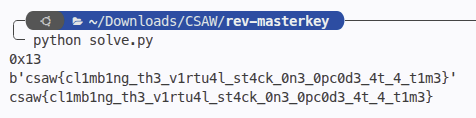

# masterkey
> Reverse engineering a custom bytecode virtual machine & modular arithmetic inversion

## About the Challenge
We are given a 64-bit ELF binary named `masterkey`. The binary takes a flag as input and validates it against a series of byte transformations executed within a custom virtual machine.

## How to Solve?

### 1. Disassembly & VM Structure
Decompiling `masterkey` reveals a virtual machine processing 53 sequential transformation blocks. The VM maintains an internal state variable $r_1$ (initialized to `0x3c`).

For each input byte $x$ at step $i$, the following forward transformations take place:
1. $x \gets x \oplus A_i$
2. $x \gets (x + B_i) \pmod{256}$
3. $x \gets \text{rol8}(x, K_i)$
4. $x \gets x \oplus 0xc3$
5. $x \gets (x \times 0x1b) \pmod{256}$
6. $x \gets x \oplus r_1$
7. Assert $x == T_i$

Following verification, $r_1$ updates dynamically using the input byte:
$$r_1 \gets (\text{rol8}(r_1 + x_{\text{input}}, K2_i) \oplus 0x9e) \pmod{256}$$

### 2. Inverting the Transformations
Because all 8-bit operations are bijective, every step can be inverted directly:
- **Modular multiplication inverse**: $\gcd(0x1b, 256) = 1$. The modular inverse is:
  $$0x1b^{-1} \pmod{256} = 0x13 \quad (27 \times 19 = 513 \equiv 1 \pmod{256})$$
- **Bitwise rotation inverse**: $\text{rol8}(x, K)^{-1} = \text{ror8}(x, K)$.
- **Addition inverse**: $(x - B_i) \pmod{256}$.
- **XOR inverse**: self-inverting.

Inverting backward from expected target byte $T_i$:
```python
x = T
x ^= r1
x = (x * 0x13) & 0xff
x ^= 0xc3
x = ror8(x, K)
x = (x - B) & 0xff
x ^= A

flag.append(x)

# Advance r1 for next block
r1 = (r1 + x) & 0xff
r1 = rol8(r1, K2)
r1 ^= 0x9e
```

### 3. Execution
Running `solve.py` solves all 53 blocks sequentially:



```text
flag : csaw{cl1mb1ng_th3_v1rtu4l_st4ck_0n3_0pc0d3_4t_4_t1m3}
```
