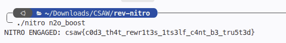

# nitro
> Reverse engineering self-modifying binary & runtime code decryption

## About the Challenge
We are provided with a 64-bit ELF binary named `nitro`. The binary requires a secret command-line argument to unlock its functionality.

## How to Solve?

### 1. Static Analysis & Self-Modifying Code
Decompiling `nitro` reveals that:
- It calls `mprotect` on its own `.text` segment to grant write permissions.
- It checks the command-line argument (`argv[1]`). If the string matches `"n2o_boost"`, it executes a decryption loop that decodes an encrypted code blob of 349 (`0x15d`) bytes located at `0x40130e`.
- The decrypted routine reads from an encrypted table at `0x402020` (length 47 / `0x2f` bytes) and XORs it with values derived from the decrypted code blob:
  $$b = (\text{blob}[(i \times 7 + 3) \pmod{349}] + i \times 5 + 0x6b) \pmod{256}$$
  $$\text{flag}[i] = \text{table}[i] \oplus b$$

### 2. Dumping and Simulating via GDB
In `solve.py`, GDB can be used to set a breakpoint immediately after code decryption at `0x40130d`, dump the decrypted memory blob and table, and compute the flag algorithmically:

```python
def compute_flag(blob, table):
    length = len(blob)  # 0x15d = 349
    key = 0x6b
    out = bytearray()
    for i in range(0x2f):
        idx = (i * 7 + 3) % length
        b = (blob[idx] + i * 5 + key) & 0xff
        out.append(table[i] ^ b)
    return bytes(out)
```

### 3. Direct Execution
Since the trigger key is `"n2o_boost"`, simply running the binary with this argument causes it to decrypt and print the flag:

```bash
$ ./nitro n2o_boost
NITRO ENGAGED: csaw{c0d3_th4t_rewr1t3s_1ts3lf_c4nt_b3_tru5t3d}
```



```text
flag : csaw{c0d3_th4t_rewr1t3s_1ts3lf_c4nt_b3_tru5t3d}
```
