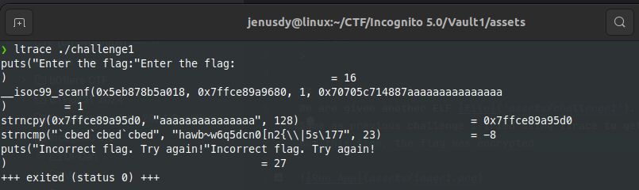

# Vault1
>

## About the Challenge
We are given another ELF [file]('assets/challenge1').
Same as previous challenge I tried using ltrace to get the flag.
But this time, the flag was encrypted




## How to Solve?
After we know that program encrypts the flag. So we need look into the program and analyze that.
I use [Ghidra](https://github.com/NationalSecurityAgency/ghidra/) to reverse the file binary

Inside the program there is a function use to encrypt our input
```c
void mysteryFunction(long param_1)
{
  int local_c;
  
  for (local_c = 0; *(char *)(param_1 + local_c) != '\0'; local_c = local_c + 1) {
    *(byte *)(param_1 + local_c) =
         *(byte *)(param_1 + local_c) ^ (char)local_c + (char)(local_c / 5) * -5 + 1U;
  }
  return;
}
```

And after that our input will be compared with encrypted string ```hawb~w6q5dcn0[n2{\\|5s\177```

So our task is to reverse this function to obtain the flag from encrypted string. 
Below is the reversed function that I wrote in Python

```python
str = 'hawb~w6q5dcn0[n2{\\|5s\177'

def decode(encoded_string):
    decoded_result = bytearray(encoded_string, 'utf-8')  # Convert the encoded string to a bytearray
    
    for i in range(len(decoded_result)):
        # Reverse the XOR operation to decode the string
        decoded_result[i] = decoded_result[i] ^ (i + (i // 5) * -5 + 1)
    
    return decoded_result.decode('utf-8')

print(decode(str))
```
If we run that code above it will print the flag we want

```text
flag : ictf{ictf{v4r1abl3_k3y_x0r}
```


