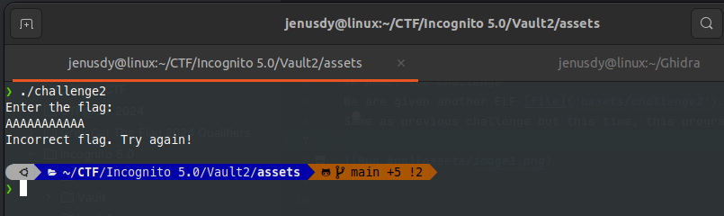

# Vault1
>

## About the Challenge
We are given another ELF [file]('assets/challenge2').
Same as previous challenge but this time, this program use more advance technic to encrypt the flag.



## How to Solve?
I use [Ghidra](https://github.com/NationalSecurityAgency/ghidra/) to reverse and analyze the file binary

Inside the program there is a function use to encrypt our input
```c
bool checkFlag(char *param_1){
  int iVar1;
  char local_a8 [128];
  undefined8 local_28;
  undefined8 local_20;
  undefined8 local_18;
  
  local_28 = 0x7a32567b6879656c;
  local_20 = 0x22785e7133237834;
  local_18 = 0x7f56305b5d6c77;
  strncpy(local_a8,param_1,0x80);
  encrypt(local_a8,(int)param_1);
  iVar1 = strncmp(local_a8,(char *)&local_28,0x18);
  return iVar1 == 0;
}

void encrypt(char *__block,int __edflag)
{
  byte bVar1;
  char cVar2;
  int local_14;
  
  for (local_14 = 0; __block[local_14] != '\0'; local_14 = local_14 + 1) {
    bVar1 = (byte)(local_14 >> 0x1f);
    cVar2 = rotateChar((int)(char)(((char)local_14 + (bVar1 >> 6) & 3) - (bVar1 >> 6) ^
                                  __block[local_14]),3);
    __block[local_14] = cVar2;
  }
  return;
}
```
What we need right here is just reverse ```encrypt``` function above and use variable local_28, local_20 and local_18 
as encrypted flag that we need to decrypt

So this is python function to reverse the flag
```python
def reverse_rotate_char(rotated_char, rot):
    if 'a' <= rotated_char <= 'z':
        return chr((ord(rotated_char) - ord('a') - rot) % 26 + ord('a'))
    elif 'A' <= rotated_char <= 'Z':
        return chr((ord(rotated_char) - ord('A') - rot) % 26 + ord('A'))
    else:
        return rotated_char


flag = ""
enc = ["0x7a32567b6879656c", "0x22785e7133237834", "0x7f56305b5d6c77"]
enc = b"".join(bytes.fromhex(x[2:])[::-1] for x in enc)


for i, v in enumerate(enc):
    tmp = i >> 0x1f
    flag += chr((ord(reverse_rotate_char(chr(v), 3)) + (tmp >> 6) ^ (i + (tmp >> 6) & 3)) + (tmp >> 6))

print("FLAG:", flag)
```

And after we run this we get the flag

```text
flag : ictf{R0t4t!0n_w!th_X0R}
```


