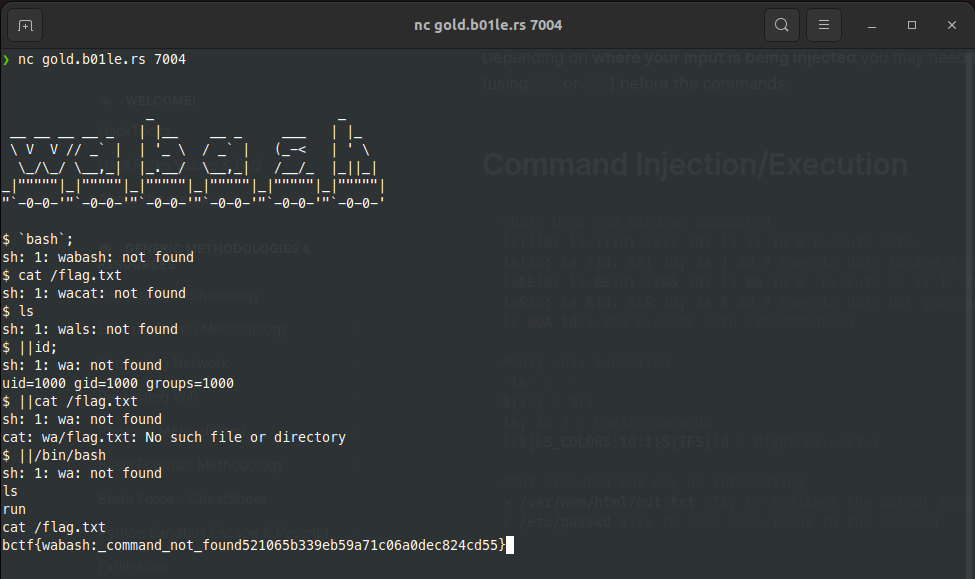

# Wabash
> nc gold.b01le.rs 7004

## About the Challenge
We are given a service that runs on gold.b01le.rs port 7004.
When I tried to connect, we are provided a bash that can run every command we want.

But every time we type a command. It always adds `wa` in front of that word

For example, If we type ```cat flag.txt```

It will run command ```wacat waflag.txt``` and this command is not valid.

## How to Solve?
This is a bash jail challenge. So we just need to escape by using ```||``` pipe char
```bash
$ || cat flag.txt
```



```text
flag : bctf{wabash:_command_not_found521065b339eb59a71c06a0dec824cd55}
```


