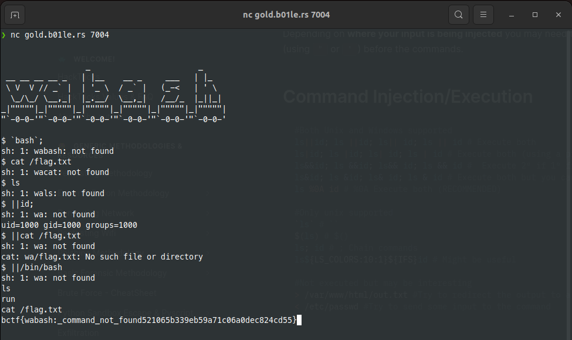

# Wabash
>

## About the Challenge
We are given an ELF [file]('assets/challenge0').
And if you try to run the file, it's going to ask you about secret code.




## How to Solve?
At the first time, we assume that this program gonna using string comparison
and to check this. We can use ```ltrace```

```ltrace is a unix utility to tracing library call made by a program```

After we run that, we got the flag


```text
flag : ictf{welc0me_t0_rev3rs1ng}
```


